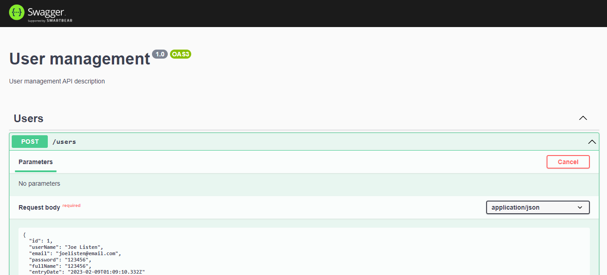

# API-Reset-com-NestJs

API de gerenciamento de usuários utilizando conceitos como: aplicações RESET, verbos HTTP, utilização de decorators, 
criação de serviços, padrões de projetos, inversão de controle e injeção de dependências, <em>providers</em>, tipagens TypeScript,
<em>path params</em>, processo de validação com  <em>class-validator </em> e  <em>class-transformer</em>, <em>ValidationPipe</em>, validação customizaada, serialização, interceptadores, <em>ClassSerializerInterceptor</em>, Tratar erros com filtros de exceção, modelo de maturidade de Leonard Richardson, <em>NestResponse</em>, adaptadores do Express e do Fastify e utilização do Swagger API para documentação da API.

### Clone o reposotório

```bash
git clone https://github.com/CarolineBarbosaM/API-Reset-com-NestJs.git

```

### Instale a Dependências:

```bash
npm install
```

### Execute o Projeto

1. Executar projeto
```bash
npm run start
```

2. Executar como Dev
```bash
npm run start:dev
```

3. Executar Teste Unitários Jest
```bash
npm run test
```

4. Executar Coverage
```bash
npm run test:cov
```

### Documentação:

[Swagger API](http://localhost:3000/api/)



### Referências:

0. [Documentação NestJs](https://docs.nestjs.com/)

1. Cursos Alura:
    - APIs REST com NestJS: buscas, validação, serialização e detalhes arquiteturais
    - Node.js: testes unitários e de integração
    - Swagger: documentando suas APIs

2. Leitura:

    - Orientação a Objetos e SOLID para Ninjas - **Maurício Aniche**
    - [NestJS - Swagger - Documentação de Endpoint](https://github.com/FabricaDeSinapse/nestjs-documentacao-swagger/blob/main/README.md)
